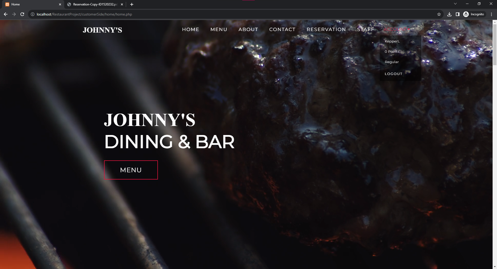
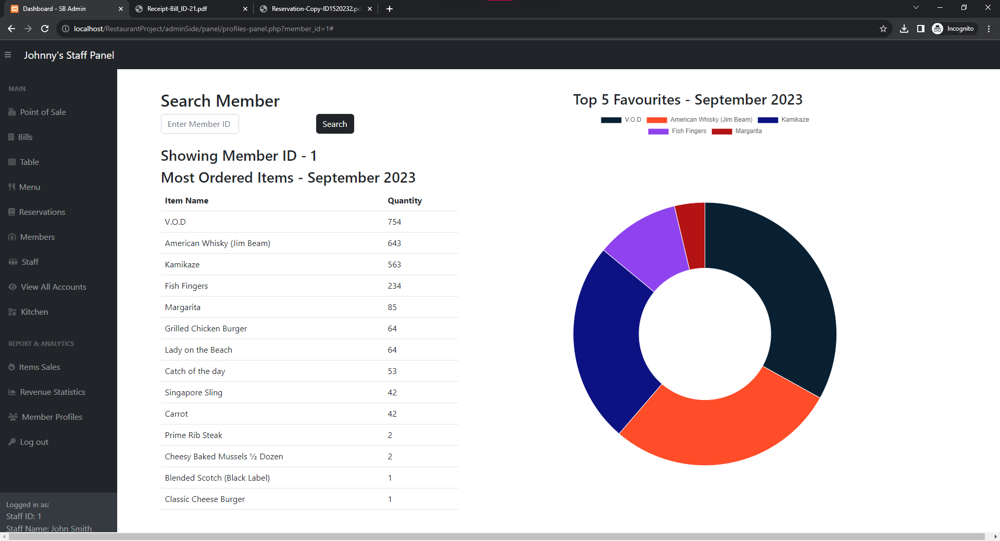
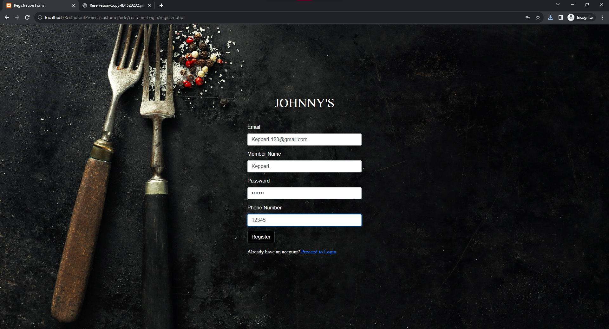
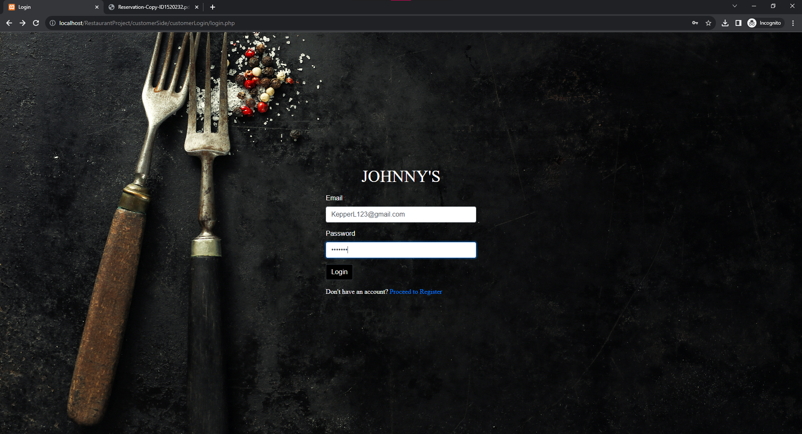
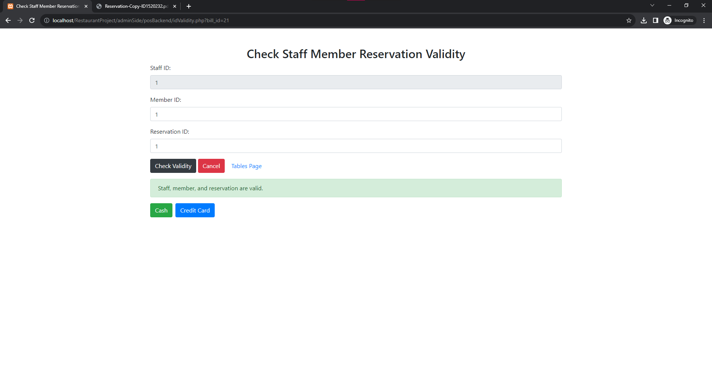

# 🍽️ Restaurant POS & Management System

> A full-featured, modern Point of Sale (POS) and Restaurant Management Web Application built for seamless dining operations, online table reservations, kitchen workflow management, and real-time sales analytics.

---

## 🌟 Technologies Used


---

## ⚡ Key Features

### 👤 Customer Experience (`customerSide`)
- 📅 **Table Reservation System**: Check real-time table availability, select reservation slots, and receive digital receipts.
- 🍕 **Digital Menu & Ordering**: Browse menu items by categories and place orders effortlessly.
- 🔑 **User Authentication**: Secure registration, login, and password reset functionalities.
- ⭐ **Membership & Loyalty**: Earn profile points and unlock member benefits upon dining.
- 🧾 **Order Status Tracking**: Live order updates and itemized receipt viewing.

### 🛡️ Admin & Staff Operations (`adminSide`)
- 🖥️ **Point of Sale (POS) Terminal**: 
  - Manage table assignments and customer billing.
  - Support multiple payment modes (Cash, Credit/Debit Card, UPI).
  - Print itemized receipts using built-in FPDF support.
- 🍳 **Kitchen Display System (KDS)**: Real-time kitchen order panel with completion and status toggle.
- 📊 **Sales Analytics & Reports**:
  - Interactive charts and graphs for daily, weekly, and monthly sales.
  - Downloadable financial reports.
- 👥 **Staff & Customer CRUD**: Full management of staff roles, customer profiles, and table configurations.

---

## 📸 Interface Screenshots

| Home Page | User Dashboard |
| :---: | :---: |
|  |  |

| POS Terminal | Kitchen Panel |
| :---: | :---: |
|  |  |

| Order Checkout | Card Payment |
| :---: | :---: |
|  |  |

| Sales Analytics | Profile Management |
| :---: | :---: |
|  |  |

<details>
<summary><b>📷 Click to view all additional screenshots</b></summary>

### Registration & Login




### Reservations & Billing




</details>

---

## 🚀 Quick Start & Installation

### Prerequisites
- **XAMPP / WAMP / MAMP** (PHP 7.4+ & MySQL database server)
- Modern web browser (Chrome, Edge, Firefox)

### Setup Instructions

1. **Clone the Repository**:
   ```bash
   git clone https://github.com/hetmansuriya27-ui/POS-SYSTEM.git
   cd POS-SYSTEM
   ```

2. **Start Local Server**:
   - Move the repository directory to your local web server root (e.g., `C:\xampp\htdocs\POS-SYSTEM`).
   - Open XAMPP Control Panel and start **Apache** and **MySQL**.

3. **Import Database**:
   - Open phpMyAdmin (`http://localhost/phpmyadmin`).
   - Create a new database named `restaurantDB`.
   - Import `restaurantDB.txt` or `scratch/backup_restaurant.sql` into `restaurantDB`.

4. **Verify Database Configuration**:
   - Ensure `adminSide/config.php` and `customerSide/config.php` match your local MySQL settings:
     ```php
     define('DB_HOST', 'localhost');
     define('DB_USER', 'root');
     define('DB_PASS', ''); // Set your MySQL password if any
     define('DB_NAME', 'restaurantDB');
     ```

5. **Launch Application**:
   - Access the app at `http://localhost/POS-SYSTEM/` in your browser.

---

## 🔑 Demo Login Credentials

| Role | Account / Identifier | Password | Access Level |
| :--- | :--- | :--- | :--- |
| **Admin** | `99999` | `12345` | Full Control (Analytics, Staff, POS, Reports) |
| **Staff** | `1` | `password123` | POS Operations & Kitchen Panel |
| **Staff** | `7` | `robertpass` | POS Operations & Kitchen Panel |
| **Customer** | `dadsvawvid@gmail.com` | `david4pass` | Table Booking & Online Ordering |
| **Customer** | `zoe@gmail.com` | `passworddef` | Table Booking & Online Ordering |

---

## 📁 Repository Structure

```
POS-SYSTEM/
├── adminSide/              # Admin/Staff POS, Kitchen Display, and Analytics
├── customerSide/           # Customer Portal (Reservations, Menu, Orders)
├── RestaurantProjectImages/# Screenshot assets
├── src/                    # Enterprise, hardware & offline utilities
├── restaurantDB.txt        # Initial MySQL database schema & seed data
├── index.php               # Root entry redirector
└── README.md               # Project documentation
```

---

## 📄 License

This project is maintained for educational and commercial POS demonstration purposes.
