# 🍽️ Restaurant POS & Management System (X Hotel)

> A full-featured, modern Point of Sale (POS) and Restaurant Management Web Application built for seamless dining operations, online table reservations, kitchen workflow management, and real-time sales analytics.

---

## 🌐 Live Deployed Websites

The application is live on **Firebase Hosting**:

| Portal | Live URL | Primary Target |
| :--- | :--- | :--- |
| 👤 **Customer Website** | [pos-system-1276b-24326.web.app](https://pos-system-1276b-24326.web.app) | Landing Page, Reservations & Menu |
| 🛡️ **Admin & Staff Portal** | [pos-system-1276b.web.app](https://pos-system-1276b.web.app) | Staff Login, POS Terminal, Kitchen & Analytics |
| 📱 **Online Ordering Portal** | [pos-system-1276b-75869.web.app](https://pos-system-1276b-75869.web.app) | Digital Customer Ordering Interface |

*Alternative Firebase domains:*
- Customer: `https://pos-system-1276b-24326.firebaseapp.com`
- Staff/Admin: `https://pos-system-1276b.firebaseapp.com`
- Ordering: `https://pos-system-1276b-75869.firebaseapp.com`

---

## ⚡ Technologies & Stack


---

## 📸 Complete System Screenshots

Below is the visual tour of all 16 interface modules in the system with descriptive titles:

### 1. 👤 Customer Portal Screenshots

#### 🔹 Customer Home Landing Page
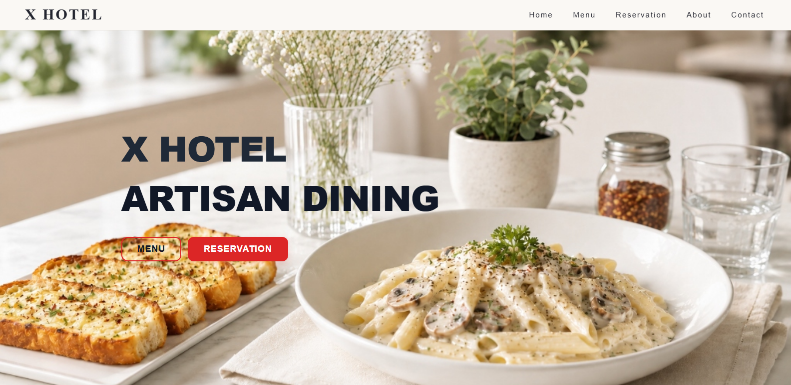

#### 🔹 Online Table Reservation Booking
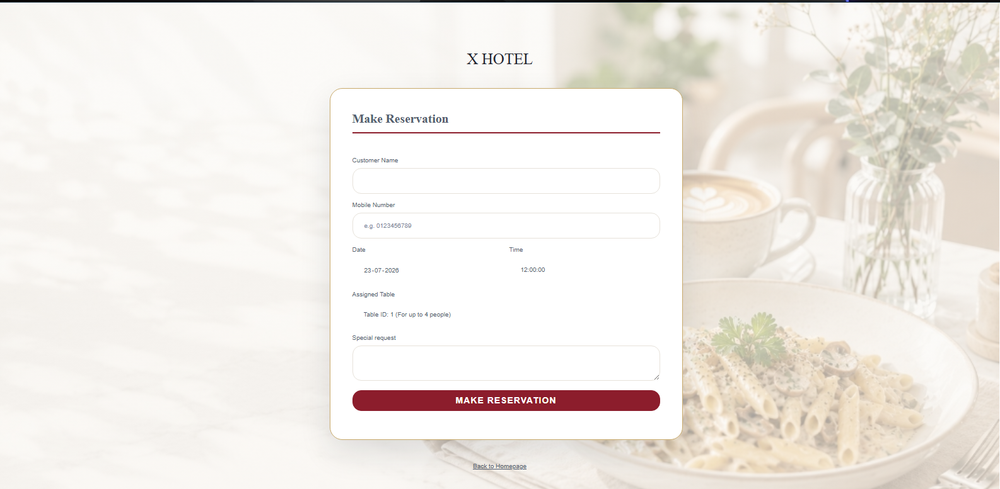

---

### 2. 🛡️ Staff & POS Terminal Screenshots

#### 🔹 Staff Portal Authentication
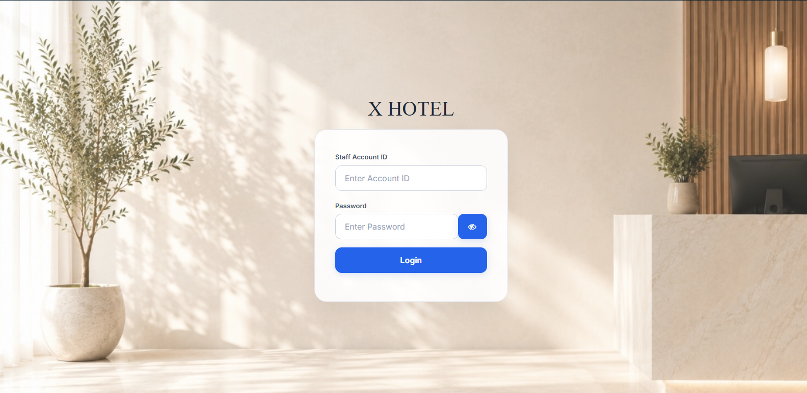

#### 🔹 Waiter Service & Ordering Panel
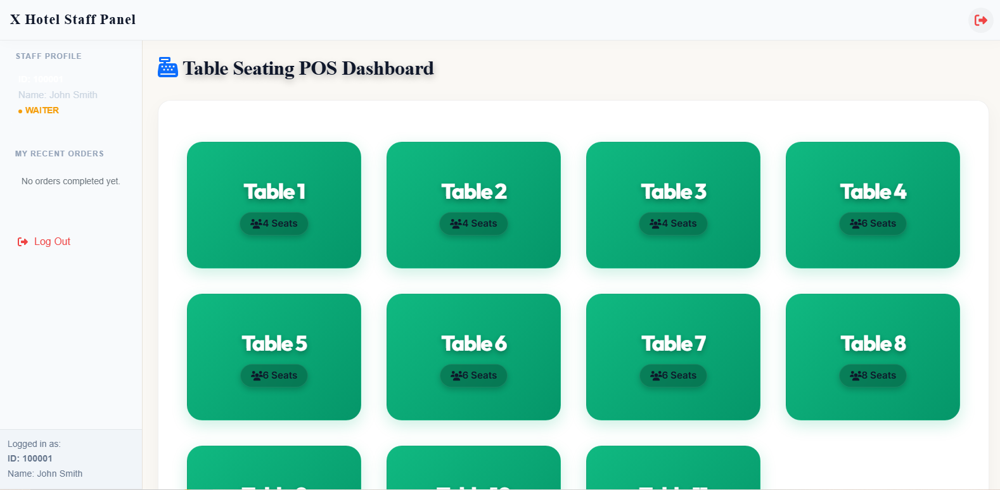

#### 🔹 Interactive POS Table Layout & Billing
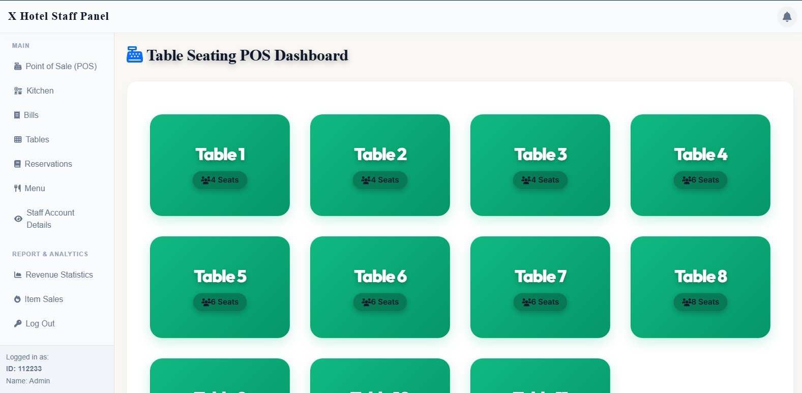

#### 🔹 POS Itemized Order Summary (Pre-Payment)
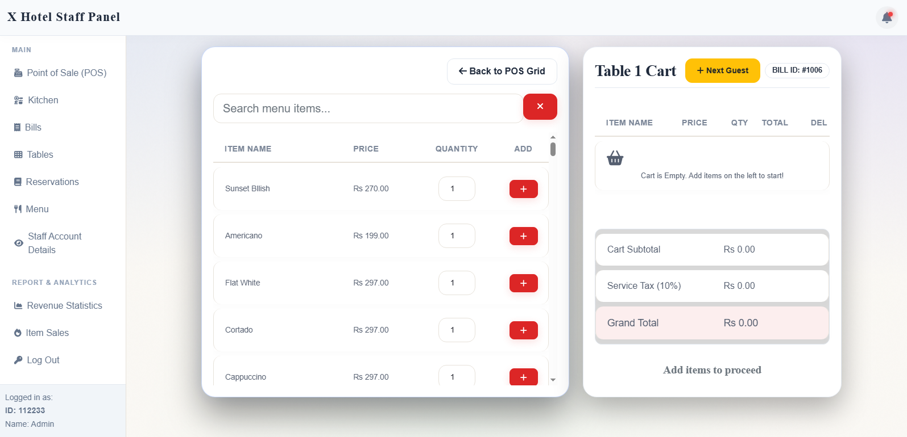

#### 🔹 Cash Payment Checkout Screen
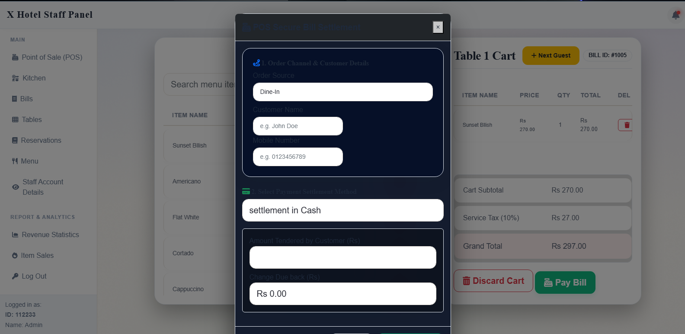

#### 🔹 Credit / Debit Card Payment Processing
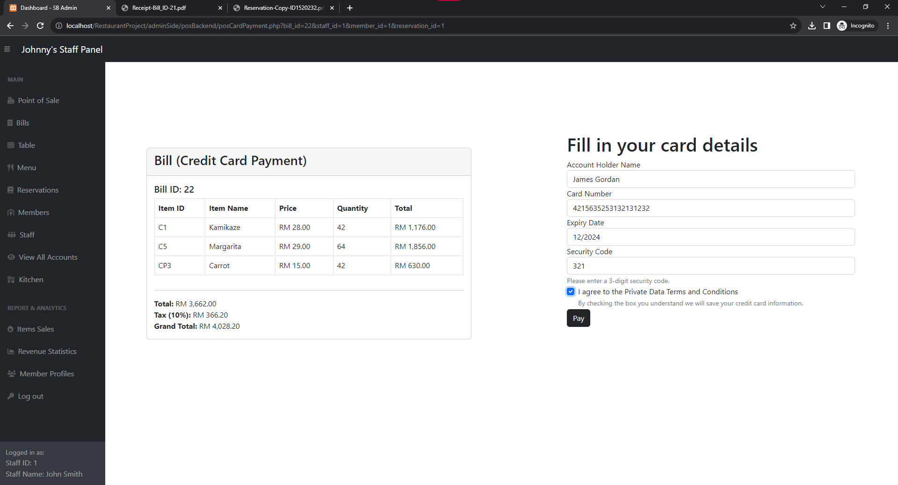

---

### 3. 🍳 Kitchen & Operations Screenshots

#### 🔹 Real-Time Kitchen Display System (KDS)
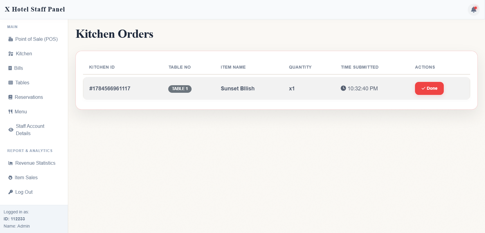

#### 🔹 Chef Control Center & Kitchen Overview
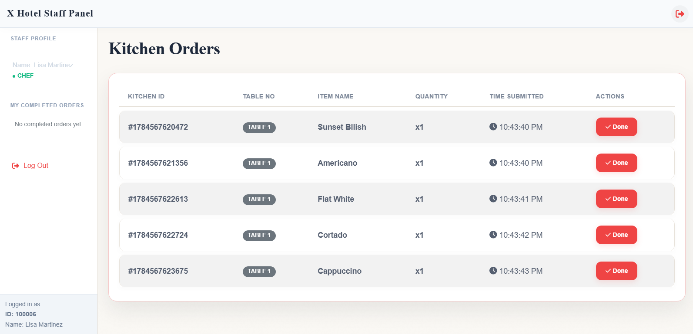

#### 🔹 Table Capacity & Occupancy CRUD Panel
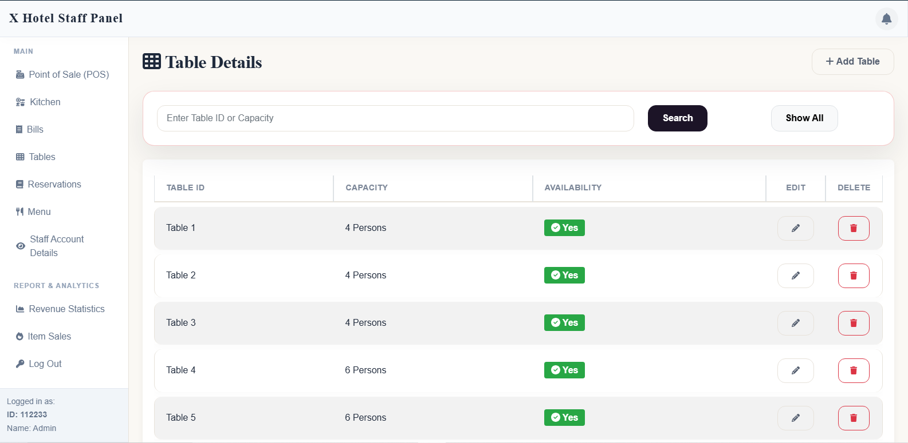

---

### 4. 📊 Analytics, Billing & Management Screenshots

#### 🔹 Bills & Invoicing History Panel
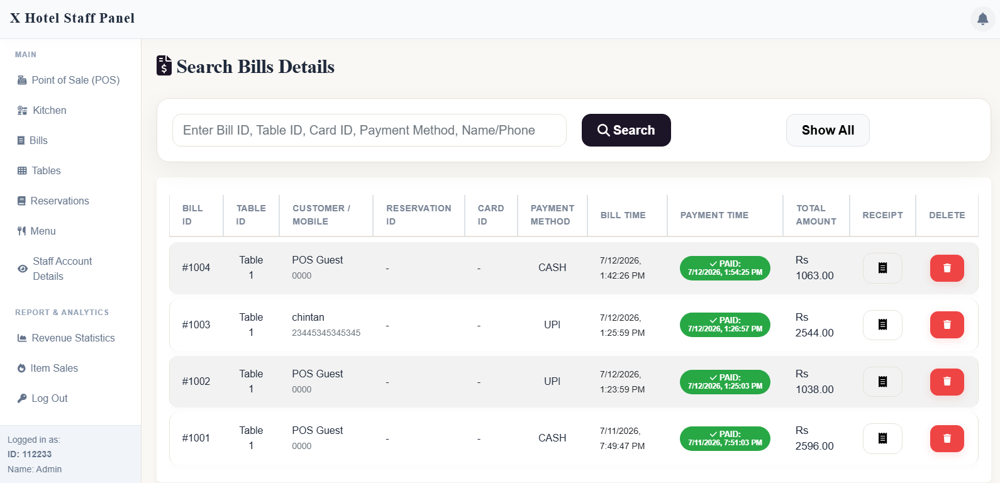

#### 🔹 Sales & Revenue Breakdown Dashboard
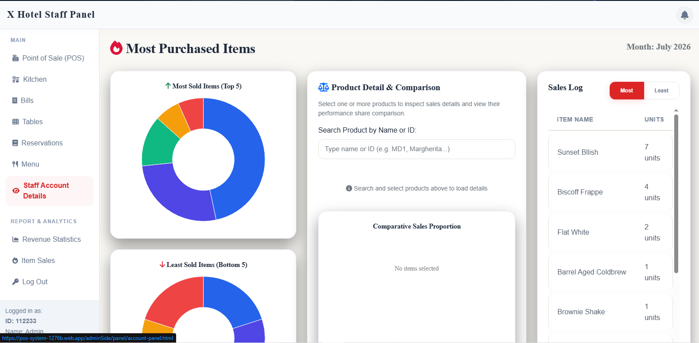

#### 🔹 Visual Sales Analytics & Statistics
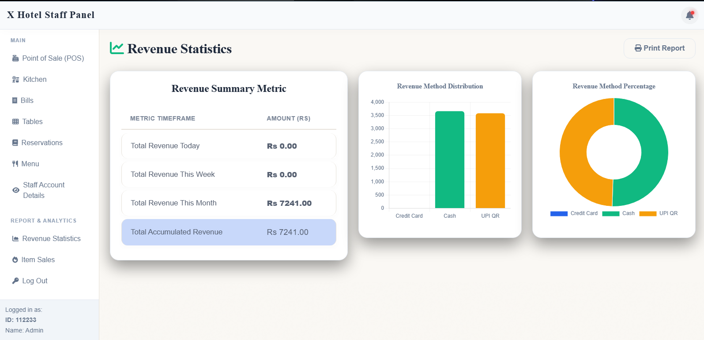

#### 🔹 Menu Items Management & Pricing CRUD
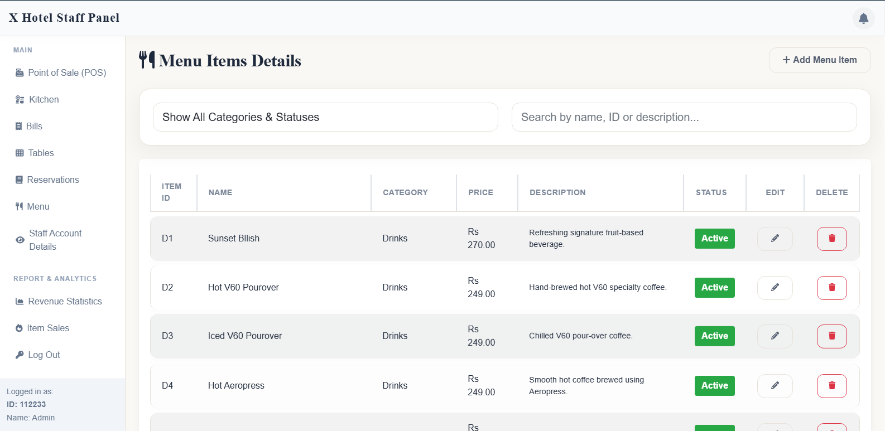

#### 🔹 Staff Account Details & Roles Management
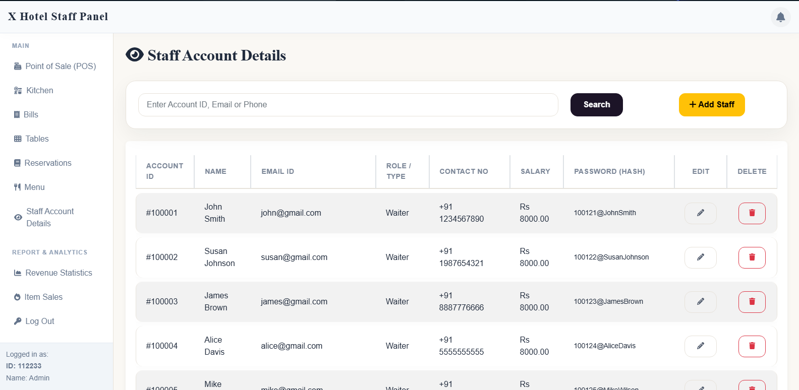

---

## 🔑 System Credentials

### 🛡️ Staff & Admin Credentials (Staff Portal)
> **Login Page:** `http://localhost/POS-SYSTEM/adminSide/StaffLogin/login.php` or [Live Staff Portal](https://pos-system-1276b.web.app)  
> *Login using **Account ID** and **Password**.*

| Role | Account ID | Staff Name | Email Address | Password |
| :--- | :--- | :--- | :--- | :--- |
| **Admin** | `112233` | Admin | `het.mansuriya27@gmail.com` | `112233@Xhotel` |
| **Manager** | `100007` | Robert Miller | `robert@gmail.com` | `100127@RobertMiller` |
| **Manager** | `100008` | Emily Moore | `emily@gmail.com` | `100128@EmilyMoore` |
| **Chef** | `100006` | Lisa Martinez | `lisa@gmail.com` | `100126@LisaMartinez` |
| **Chef** | `100009` | David Taylor | `david@gmail.com` | `100129@DavidTaylor` |
| **Waiter** | `100001` | John Smith | `john@gmail.com` | `100121@JohnSmith` |

---

### 👤 Customer Account Credentials (Customer Portal)
> **Login Page:** `http://localhost/POS-SYSTEM/customerSide/customerLogin/login.php` or [Live Customer Site](https://pos-system-1276b-24326.web.app)  
> *Login using **Email Address** and **Password**.*

| Account Type | Email Address | Password | Name |
| :--- | :--- | :--- | :--- |
| **Customer** | `john@gmail.com` | `100121@JohnSmith` | John Smith |
| **Customer** | `susan@gmail.com` | `100122@SusanJohnson` | Susan Johnson |
| **Customer** | `james@gmail.com` | `100123@JamesBrown` | James Brown |
| **Customer** | `het.mansuriya27@gmail.com` | `112233@Xhotel` | Het Mansuriya |

---

## 💻 How to Run at Localhost

### Method 1: Using XAMPP / WAMP (Recommended for Full PHP + MySQL Support)

1. **Clone or Download the Repository**:
   ```bash
   git clone https://github.com/hetmansuriya27-ui/POS-SYSTEM.git
   ```

2. **Move to Web Server Root**:
   - For **XAMPP**: Copy the `POS-SYSTEM` directory into `C:\xampp\htdocs\`
   - For **WAMP**: Copy into `C:\wamp64\www\`

3. **Start Apache & MySQL**:
   - Open **XAMPP Control Panel** (or WAMP) and start both **Apache** and **MySQL** services.

4. **Import Database**:
   - Open your browser and go to `http://localhost/phpmyadmin`
   - Click **New** and create a database named `restaurantdb`
   - Click **Import** tab and choose `restaurantDB.txt` (or `scratch/backup_restaurant.sql`)
   - Click **Go** to execute and populate all tables and seed data.

5. **Configure Database Connection**:
   - Check `adminSide/config.php` and `customerSide/config.php` to ensure matching credentials:
     ```php
     define('DB_HOST', 'localhost');
     define('DB_USER', 'root');
     define('DB_PASS', ''); // Set your MySQL password if any
     define('DB_NAME', 'restaurantdb');
     ```

6. **Access Local App**:
   - **Customer Landing Page:** `http://localhost/POS-SYSTEM/customerSide/home/home.php`
   - **Staff / Admin Login:** `http://localhost/POS-SYSTEM/adminSide/StaffLogin/login.php`
   - **Root Entry:** `http://localhost/POS-SYSTEM/`

---

### Method 2: Using PHP Built-in Server (Quick Local Test)

```bash
cd POS-SYSTEM
php -S localhost:8000
```
- Open `http://localhost:8000` in your web browser.

---

## 📁 Repository Structure

```
POS-SYSTEM/
├── adminSide/              # Admin/Staff POS, Kitchen Display, and Analytics
│   ├── StaffLogin/         # Staff authentication portal
│   ├── panel/              # Management panels (POS, Kitchen, Sales, Menu)
│   └── config.php          # Admin database configuration
├── customerSide/           # Customer Portal
│   ├── customerLogin/      # Customer login and registration
│   ├── CustomerReservation/# Table booking & receipt generation
│   ├── home/               # Customer menu & ordering interface
│   └── config.php          # Customer database configuration
├── RestaurantProjectImages/# Interface screenshot gallery (16 Module Images)
├── restaurantDB.txt        # Full MySQL database schema & seed script
├── firebase.json           # Firebase Hosting & rewrite configurations
├── .firebaserc             # Firebase project target mappings
└── README.md               # Application documentation
```
